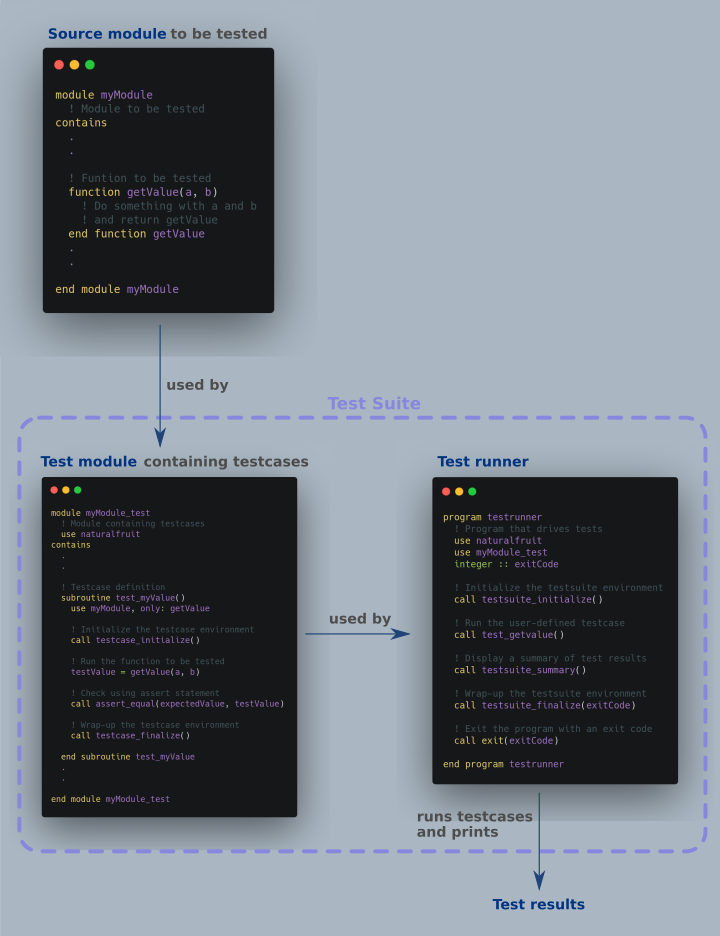

[](https://travis-ci.com/github/cibinjoseph/naturalFRUIT)
<br/>

<br/>

# naturalFRUIT
A purely Fortran based unit testing framework derived from the original [Fortran Unit Test Framework (FRUIT)](https://sourceforge.net/projects/fortranxunit/).

## Why the new project?
1. Similar projects like FRUIT and pFUnit utilize preprocessors written in other programming languages like Ruby to aid auto-generation of code and reporting easier. However, the time required to set up and learn a whole another language seems to hinder users from adopting the testing framework. naturalFRUIT follows the [KISS principle](https://en.wikipedia.org/wiki/KISS_principle) and maintains only Fortran libraries necessary for testing with minimal to no dependencies on other programming languages.
2. FRUIT documentation appeared to be generally lacking for intermediate to advanced uses. This project utilizes auto-generated documentation using [FORD](https://github.com/Fortran-FOSS-Programmers/ford).
3. FRUIT also appeared to not be updated constantly. A collaborative open-source based framework, hopefully improves this and reflects improvements to Fortran.
4. FRUIT, just like Fortran, did not contain exception handling. This meant it could not be used in testing using continous integration frameworks like Travis. naturalFruit gets over this to a certain extent and can be used with these frameworks.

## Installation
naturalFruit expects to be compiled and used along side your Fortran libraries without explicit installation. The following straightforward commands should get you going.
```bash
gfortran -c naturalFruit.f90        # Compile naturalFruit
gfortran main.f90 naturalFruit.o    # Link and use!
```

## Usage
**A word of warning**: This repo is under very active development and a lot of drastic changes are being made at the moment. These include removal of deprecated and redundant subroutines and functions. Until this disclaimer is removed, users are cautioned against using naturalFRUIT and advised to use the original FRUIT module.</br></br>

The following image illustrates the typical workflow and subroutines for unit testing using naturalFRUIT:  



## Documentation
Read the FORD generated [Documentation](https://cibinjoseph.github.io/naturalFRUIT/page/index.html).   
| Quick links |  
| ------------------ |
| [Assert methods](https://cibinjoseph.github.io/naturalFRUIT/page/AssertMethods/index.html) |
| [Tutorials](https://cibinjoseph.github.io/naturalFRUIT/page/Tutorials/index.html) |
| [All Procedures](https://cibinjoseph.github.io/naturalFRUIT/lists/procedures.html) |

## Requirements
naturalFRUIT has been tested to work with gfortran and ifort for all versions of Fortran 90 and above.

## Contributing
All contributions are to be made to the `dev` branch through pull requests. The `master` branch is kept aside for releases.
During release, the master branch is tagged with 'vX.X.X' and pushed to remote.

### Creating documentation
For adding new documentation,  
1. Fork this repo and switch to *dev* branch.  
2. Make the necessary changes. FORD parses comments with the marks *!!* in the source code and contents of the folder *ford_input/* for creating documentation.   
3. Run the bash script `createDocs.sh` in the topmost directory of the repo to make FORD autocreate the documentation webpages.  
4. Commit all changes.  
5. Send a pull request to the *dev* branch.  

## License
[BSD-3-Clause](LICENSE)

## Author
[Cibin Joseph](https://github.com/cibinjoseph)

## Acknowledgements
The author of [FRUIT](https://sourceforge.net/projects/fortranxunit/), Andrew H. Chen and all contributors to it are gratefullly acknowledged.
